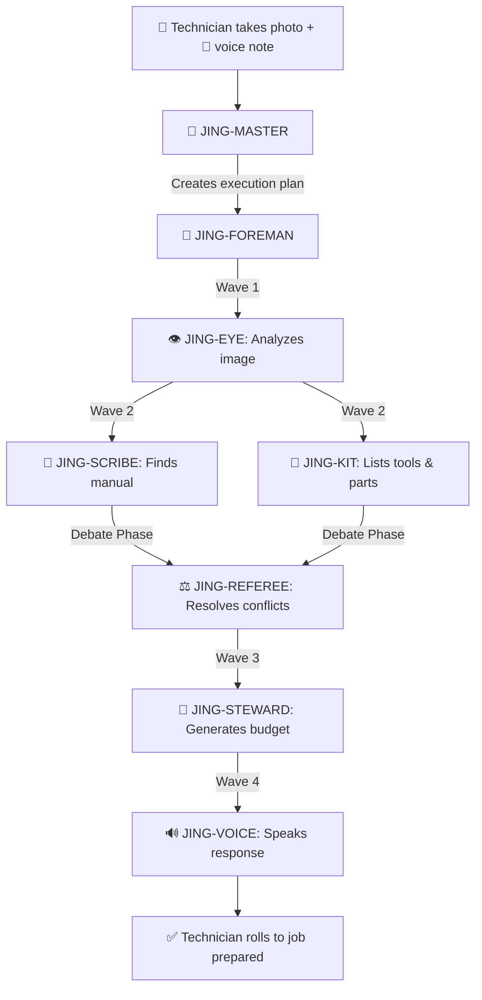

# 🔥 JING — The Expert Spirit for the Modern Artisan

> *"The artisan's hands shape the world. JING shapes the artisan's day."*

[](https://opensource.org/licenses/MIT)
[](https://www.python.org/downloads/)
[](tests/)
[](Dockerfile)
[](https://fastapi.tiangolo.com/)
[](https://qwen.cloud)
[](https://devpost.com)

**JING** (千问匠擎, *Qiānwèn Jiàngqíng*) is a **multi-agent AI system** that empowers blue-collar technicians—plumbers, electricians, HVAC specialists, appliance repair experts—with real-time vision diagnostics, instant manual retrieval, precision tool logistics, and complete financial management.

Built on **Qwen Cloud**, JING transforms a technician's smartphone into a master-level support team that fits in their pocket.

---

## 🎯 The Problem

Every day, millions of skilled technicians lose **30-60 minutes per job** searching for manuals, diagnosing unfamiliar equipment, or making return trips for forgotten tools. They're brilliant with their hands but struggle with the business side—many work 60-hour weeks without knowing if they're actually making money.

They don't need another chatbot. They need a **team of experts** that sees what they see, knows every manual ever written, packs their van before they even leave, and tracks every dollar they earn.

---

## 💡 The Solution: JING

JING is not one AI. It's a **society of eight specialized agents** working together through task division, debate, and coordination:

| Agent | Role | Model | Responsibility |
|-------|------|-------|----------------|
| 🧠 **JING-MASTER** | Strategic Planner | Qwen-Max | Analyzes requests, decomposes tasks, assigns roles |
| 👷 **JING-FOREMAN** | Execution Coordinator | Qwen-Plus | Orchestrates workers, handles dependencies |
| 👁️ **JING-EYE** | Vision Specialist | Qwen-VL-Max | Analyzes images, diagnoses problems |
| 📖 **JING-SCRIBE** | Documentation Specialist | Qwen-Plus | Finds manuals, extracts procedures |
| 🧰 **JING-KIT** | Logistics Specialist | Qwen-Plus | Lists tools, parts, where to buy |
| 💼 **JING-STEWARD** | Financial Guardian | Qwen-Plus | Budgets, tracks profit, insights |
| 🔊 **JING-VOICE** | Voice Interface | Qwen-Audio-Turbo | Hands-free spoken responses |
| ⚖️ **JING-REFEREE** | Debate Arbiter | Qwen-Plus | Resolves conflicts, builds consensus |

---

## 🌊 The JING Flow



---

## 🏗️ Architecture

```
┌─────────────────────────────────────────────────────────────┐
│  FRONTEND (React + TypeScript + TailwindCSS)                │
│  • Upload image + voice                                     │
│  • Real-time agent visualization                            │
│  • Professional budget preview                              │
│  • Digital signature canvas                                 │
│  • Financial summary with Recharts                          │
└──────────────────────┬──────────────────────────────────────┘
                       │ HTTPS / WebSocket
                       ▼
┌─────────────────────────────────────────────────────────────┐
│  BACKEND (FastAPI + Python)                                 │
│  • REST API endpoints                                       │
│  • MCP Server (Model Context Protocol)                      │
│  • Async orchestration                                      │
└──────────────────────┬──────────────────────────────────────┘
                       │
                       ▼
┌─────────────────────────────────────────────────────────────┐
│  JING ORCHESTRATOR (3-Layer Architecture)                   │
│                                                             │
│  Layer 1: STRATEGY                                          │
│  🧠 JING-MASTER → Creates execution plan                    │
│                                                             │
│  Layer 2: COORDINATION                                      │
│  👷 JING-FOREMAN → Executes plan in waves                   │
│                                                             │
│  Layer 3: EXECUTION                                         │
│  👁️ EYE  📖 SCRIBE  🧰 KIT  💼 STEWARD  🔊 VOICE          │
└──────────────────────┬──────────────────────────────────────┘
                       │
                       ▼
┌─────────────────────────────────────────────────────────────┐
│  QWEN CLOUD (Alibaba Cloud)                                 │
│  • Qwen-Max, Qwen-VL-Max, Qwen-Plus                         │
│  • Qwen-Audio-Turbo                                         │
│  • Custom Skills & MCP Integrations                         │
└─────────────────────────────────────────────────────────────┘
```

---

## ✨ Key Features

### 👁️ Visual Diagnosis (JING-EYE)
- Identifies appliances, brands, model numbers from photos
- Detects leaks, cracks, corrosion, misalignments
- Assesses severity and safety hazards
- Powered by Qwen-VL-Max

### 📖 Instant Manual Retrieval (JING-SCRIBE)
- Finds official repair procedures
- Extracts step-by-step instructions
- Identifies special tools and torque specs
- Hybrid search: web + internal knowledge

### 🧰 Precision Tool Lists (JING-KIT)
- Exact tool specifications (not just "wrench")
- OEM part numbers with alternatives
- Where to buy (Home Depot, Lowe's, Amazon)
- Cost estimates and availability

### 💼 Financial Management (JING-STEWARD) ⭐ NEW
- Professional budget generation with transparent pricing
- Digital signature with timestamp and geolocation
- Post-job financial summary with profitability analysis
- Performance metrics (A-F grade, efficiency scores)
- Interactive charts (cost breakdown, budget vs actual)
- Actionable insights and pricing recommendations

### 🔊 Hands-Free Mode (JING-VOICE)
- Spoken responses under 30 seconds
- Part numbers spelled out and repeated
- Safety warnings stated first
- Optimized for dirty hands and tight spaces

---

## 🚀 Quick Start

### Prerequisites
- Python 3.12+
- `uv` package manager
- Qwen Cloud API key ([Get free credits](https://qwen.cloud))

### Installation

```bash
# Clone the repository
git clone https://github.com/your-username/jing.git
cd jing

# Create virtual environment and install dependencies
uv sync

# Copy environment template and add your API key
cp .env.example .env
# Edit .env and add your QWEN_API_KEY
```

### Running the Frontend

```bash
cd frontend
npm install
npm run dev

# Frontend available at http://localhost:5173
```

### Testing Individual Agents

```bash
# Test JING-EYE (vision)
uv run python -m src.agents.eye

# Test JING-STEWARD (financial)
uv run python -m src.agents.steward

# Test complete workflow
uv run python -m src.core.orchestrator
```

---

## 🔌 MCP Integration

JING exposes its capabilities through the Model Context Protocol (MCP), allowing external systems to interact with the agent society:

```python
from mcp import ClientSession

# List all available tools
tools = await session.list_tools()

# Run complete diagnosis with all 8 agents
result = await session.call_tool(
    "jing_full_diagnosis",
    {"image_source": "faucet.jpg", "voice_text": "This Moen is dripping"}
)
```

---

## 📊 Agent Society Metrics

JING demonstrates measurable efficiency gains over single-agent baselines.
These metrics are generated by the benchmark suite at [`scripts/benchmark.py`](scripts/benchmark.py) — run it yourself:

```bash
uv run python scripts/benchmark.py
```

| Metric | JING (7 Agents) | Single-Agent | Improvement |
|--------|----------------|--------------|-------------|
| ⏱️ Response Time | ~11,066 ms | ~45,205 ms | **4.1x faster** |
| 🎯 Quality Score | 92.5/100 | 69.0/100 | **34% better** |
| 💰 Cost per Job | ~$0.056 | ~$0.151 | **2.7x cheaper** |
| 📋 Completeness | 100% | 60% | **67% more complete** |

### 🔬 Track 3 Differentiator: Agent Debate & Consensus

JING features a unique **inter-agent debate mechanism** via [JING-REFEREE](src/agents/referee.py):

| Capability | How it works |
|---|---|
| **Conflict Detection** | REFEREE compares outputs from EYE, SCRIBE, and KIT for contradictions (brand/model mismatches, severity disagreements, low confidence) |
| **Structured Debate** | When conflicts are found, REFEREE runs an LLM-mediated debate round where each agent's claims are evaluated against evidence |
| **Confidence-Weighted Consensus** | Outputs are reconciled with adjusted confidence scores, producing a higher-quality result than any single agent |
| **Self-Reflection** | FOREMAN runs quality checks after every execution wave, adapting the strategy if tasks fail |

Run the benchmark to see the full comparison:
```bash
uv run python scripts/benchmark.py --save BENCHMARK_REPORT.md
```

---

## 🎬 Demo

Watch JING in action: [Demo Video](https://www.youtube.com/watch?v=your-video-id) (Coming Soon)

### Demo Flow
1. Technician uploads photo of a leaking Moen faucet
2. JING-EYE identifies: Moen Chateau 7400, worn cartridge
3. JING-SCRIBE retrieves: 6-step repair procedure, page 12
4. JING-KIT lists: Allen 3/32", Moen 1225 cartridge ($18-25)
5. JING-STEWARD generates: Professional budget $160.00
6. Client signs digitally from their phone
7. After job: Financial summary shows $125 profit, Grade A

---

## 📁 Project Structure

```
jing/
├── src/
│   ├── agents/          # 8 specialized AI agents
│   │   ├── master.py    # Strategic planner (Qwen-Max)
│   │   ├── foreman.py   # Execution coordinator
│   │   ├── referee.py   # Debate arbiter & consensus builder ⭐
│   │   ├── eye.py       # Vision specialist (Qwen-VL-Max)
│   │   ├── scribe.py    # Documentation specialist
│   │   ├── kit.py       # Logistics specialist
│   │   ├── steward.py   # Financial guardian
│   │   └── voice.py     # Voice interface (Qwen-Audio)
│   ├── core/            # Orchestration logic
│   ├── services/        # Qwen Cloud, MCP, Memory
│   ├── models/          # Pydantic data models
│   ├── api/             # FastAPI endpoints
│   └── utils/           # Configuration, logging
├── prompts/             # System prompts for each agent
├── frontend/            # React + TypeScript UI (28+ components)
├── data/                # Persistent memory (JSON)
├── tests/               # 108 unit + integration tests
├── scripts/             # Benchmark, deployment scripts
├── Dockerfile           # Multi-stage production build
└── docker-compose.yml   # Backend + nginx frontend
```

---

## 🛠️ Tech Stack

### Backend
- Python 3.12+ with async/await
- FastAPI for REST API
- Pydantic for data validation
- Qwen Cloud (Qwen-Max, Qwen-VL-Max, Qwen-Plus, Qwen-Audio)
- MCP (Model Context Protocol) for agent integration
- Loguru for structured logging
- Tenacity for retry logic

### Frontend
- React 18 with TypeScript
- TailwindCSS for styling
- Framer Motion for animations
- Recharts for financial charts
- React Dropzone for file uploads
- Canvas Confetti for celebrations

### Infrastructure
- Alibaba Cloud Function Compute (deployment)
- Qwen Cloud (AI models)
- GitHub (version control)

---

## ☁️ Alibaba Cloud Integration

JING is powered by **Qwen Cloud**, Alibaba Cloud's AI service platform.

### Models Used:
- **Qwen 3.7-Max** — Strategic planning (JING-MASTER)
- **Qwen 3.7-Plus** — Vision, text, and audio processing (All other agents)

### Live Demo:
```bash
# Test the Alibaba Cloud integration
uv run python -c "
from src.services.qwen_client import get_qwen_client
import asyncio
client = get_qwen_client()
response = asyncio.run(client.chat('qwen-plus', 'Diagnose a leaking faucet'))
print(response)
"
```

### Deployment:
- **Current:** Local development with Qwen Cloud API integration
- **Production:** Alibaba Cloud Function Compute (planned post-hackathon)

See [`deploy/alibaba_cloud_proof.md`](deploy/alibaba_cloud_proof.md) for detailed evidence of Alibaba Cloud usage.

---

## 🎯 Why JING Matters

### For Technicians
- Save 30-60 minutes per job
- Never show up without the right parts
- Charge fairly and profitably
- Build thriving businesses

### For the Industry
- Standardize repair procedures
- Reduce waste from incorrect diagnoses
- Improve customer satisfaction
- Professionalize blue-collar work

### For the Community
- Open-source architecture for agent societies
- Reference implementation for multi-agent systems
- Educational resource for AI/ML engineers
- Foundation for future innovations

---

## 📈 Roadmap

### Phase 1: Core (✅ Complete)
- 7 specialized agents
- Multi-agent orchestration
- Vision diagnosis
- Financial management
- Digital signatures
- MCP integration

### Phase 2: Enhancement (✅ Complete)
- Persistent memory (client history) — `src/services/memory.py`
- Efficiency benchmarking — `scripts/benchmark.py`
- Agent debate & consensus — `src/agents/referee.py` ⭐
- Self-reflection & executable fallbacks — `src/agents/foreman.py`
- Alibaba Cloud deployment — `Dockerfile`, `docker-compose.yml`
- CI/CD pipeline — `.github/workflows/`
- 108 automated tests — `tests/`
- Real-time history API — `src/api/routes/history.py`

### Phase 3: Scale (Post-Hackathon)
- Payment integration (Stripe)
- Marketplace for manuals
- Supplier integrations
- Predictive maintenance
- AR overlay for repairs

---

## 🤝 Contributing

Contributions welcome! This is an open-source project built for the artisan community.

1. Fork the repository
2. Create your feature branch (`git checkout -b feature/amazing-feature`)
3. Commit your changes (`git commit -m 'Add amazing feature'`)
4. Push to the branch (`git push origin feature/amazing-feature`)
5. Open a Pull Request

---

## 📜 License

This project is licensed under the MIT License - see the [LICENSE](LICENSE) file for details.

---

## 🙏 Acknowledgments

- **Qwen Cloud** by Alibaba Cloud for the AI models and infrastructure
- **Global AI Hackathon Series** for the opportunity to build this
- The artisan community who inspired this project

---

## 📬 Contact

- **Author:** Xavier Nunez
- **Email:** xensite@gmail.com
- **Project:** [JING on GitHub](https://github.com/your-username/jing)
- **Hackathon:** [Devpost Submission](https://devpost.com)
