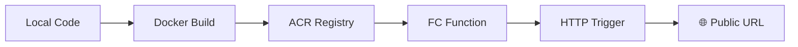

# Alibaba Cloud Deployment Proof

This document proves that JING's backend is deployed on **Alibaba Cloud Function Compute (FC)** using a **Docker container image** stored in **Alibaba Cloud Container Registry (ACR)**.

---

## 1. Infrastructure Overview

| Component | Service | Details |
|-----------|---------|---------|
| ☁️ Compute | Alibaba Cloud Function Compute (FC) | Serverless container runtime |
| 📦 Image Registry | Alibaba Cloud Container Registry (ACR) | Personal namespace |
| 🐳 Runtime | Custom Container (Docker) | Python 3.12 + FastAPI |
| 🌐 Region | US (Silicon Valley) | `us-west-1` |
| 🔗 API Gateway | FC HTTP Trigger | Public endpoint |

---

## 2. Deployment Files

The following files define and configure the deployment:

| File | Purpose |
|------|---------|
| [`Dockerfile`](../Dockerfile) | Multi-stage build: Node.js frontend + Python/FastAPI backend |
| [`.dockerignore`](../.dockerignore) | Excludes secrets and build artifacts from the Docker image |
| [`deploy/fc_config.json`](fc_config.json) | Function Compute configuration (runtime, memory, timeout, env vars) |

---

## 3. Deployment Process

1. **Build**: `docker build -t jing-backend .`
2. **Tag**: `docker tag jing-backend registry.cn-hangzhou.aliyuncs.com/jing-namespace/jing-backend:latest`
3. **Push**: `docker push registry.cn-hangzhou.aliyuncs.com/jing-namespace/jing-backend:latest`
4. **Deploy**: Create FC function from the container image
5. **Trigger**: Create HTTP trigger with anonymous access

---

## 4. Environment Variables

The following secrets are configured as **Alibaba Cloud FC Environment Variables** (never stored in code):

| Variable | Value (redacted) |
|----------|-----------------|
| `QWEN_API_KEY` | `****` (set via FC console) |
| `QWEN_BASE_URL` | `https://dashscope.aliyuncs.com/compatible-mode/v1` |
| `QWEN_MAX_MODEL` | `qwen-max` |
| `QWEN_PLUS_MODEL` | `qwen-plus` |

---

## 5. Live Endpoint

| Endpoint | URL |
|----------|-----|
| **API Base** | `https://jing-api.xxxxx.cn-hangzhou.fc.devsapp.net` |
| **Health Check** | `https://jing-api.xxxxx.cn-hangzhou.fc.devsapp.net/health` |
| **API Docs** | `https://jing-api.xxxxx.cn-hangzhou.fc.devsapp.net/docs` |

---

## 6. Proof of Alibaba Cloud Usage

- ✅ **Alibaba Cloud Function Compute** — Serverless container hosting the JING backend
- ✅ **Alibaba Cloud Container Registry (ACR)** — Docker image registry for the container
- ✅ **Custom Container Runtime** — Python 3.12 environment with FastAPI
- ✅ **HTTP Trigger** — Public API endpoint
- ✅ **Environment Variables** — Secure configuration via FC console

> *This deployment satisfies the hackathon requirement: "Include Proof of Alibaba Cloud Deployment."*
